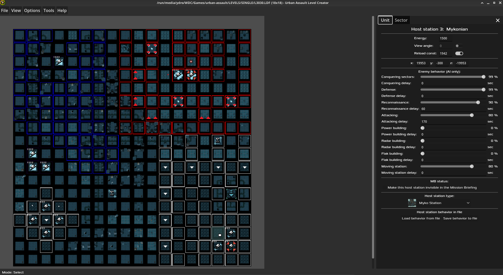

# Urban Assault Level Creator

A comprehensive level editor that simplifies the creation of levels and enables the quick design of various map elements.

## Features
- **Easy editing**: Effortlessly create new maps. With just a few clicks, your map will be ready to use.
- **Drag and drop**: Move host stations and squads by simply dragging them with the left mouse button to change their positions dynamically.
- **Real-Time Preview**: A grid-based map with top-view building images for each level set, instantly updated upon any change.
- **Save and Open**: The level can be quickly saved and opened through the file menu. It can also be opened by simply dragging and dropping a file into the editor window.
- **Quick Sector Editing**: Special buildings and sector items can be easily added to the level using a dedicated context menu by simply right-clicking.
- **Sector Owner Painting**: Hold the corresponding faction number on the keyboard and drag the left mouse button to quickly update multiple sector owners.
- **Dedicated Properties**: Each Beam Gate, Stoudson Bomb, Tech Upgrade, Host Station and Squad has its own user interface for modifying various properties.
- **Six Environment Sets**: Each environment (City, Hills, Nacht, Ice, Desert, Myko) is fully supported to handle any possible level in the game.
- **Zoom In and Out**: The map can be zoomed in and out to focus on different areas of the workflow. This is a game changer for level editing.
- **Pan Around**: Holding the middle mouse button allows you to move the map freely for quick navigation.
- **Building Designer**: An intuitive tool that displays all possible building images for the currently selected environment and allows for quick building editing in real-time.
- **Full Metropolis Dawn Support**: The editor has a special database file that can be used to adjust its capabilities for any specific mod.
- **Resize the Map**: Using a dedicated window, you can effortlessly adjust the X and Y dimensions of the currently open map.
- **Troubleshooting**: An exclamation mark will appear on the sector if there is an issue with its properties. It saves a lot of time and frustration.
- **Sector Clipboard**: You can easily copy all of a sector's properties and paste them into another location. This significantly speeds up map creation.
- **Fully Open Source**: Both the editor and its development environment are open source. You can download the entire source code, study it, fork it, and modify it as you wish.

and more...
## Download
Check out the [releases page.](https://github.com/dubstabber/Urban-Assault-Level-Creator/releases) 
## Building
1. Download Godot 4.3 from https://godotengine.org
2. Clone this repository or download the zip file then extract it
3. Open the Godot and import the project
4. Go to Project > Export...
5. If you do not have any building templates then follow along. Otherwise skip to step 10
6. Click on Add... then select the target platform
7. At the bottom click on Manage Export Templates...
8. Click on Download and Install (this will take some time)
9. Go back to Project > Export...
10. At the bottom click on Export Project...
11. Give a name for the final file and click save

Additional steps may be required depending on the platform you want to export the project to.
## License
This project is licensed under the GPL-3.0 license. See `LICENSE` for details.
