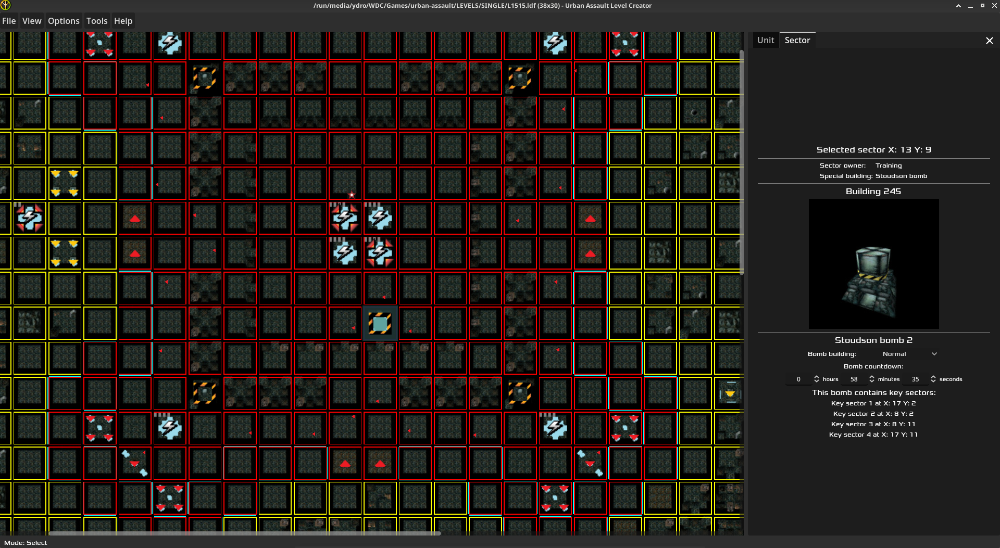

# Urban Assault Level Creator

<div align="center">
  
  
  
</div>

## 🎮 About This Project

The **Urban Assault Level Creator** is a comprehensive visual editor that transforms level creation for Urban Assault, the classic hybrid RTS/FPS game from 1998. Instead of manually editing complex text files, you can now design battle environments with just a few clicks using an intuitive, drag-and-drop interface.

**What makes this special?** Urban Assault's original level creation required deep technical knowledge and tedious text editing. This editor gives you visual tools while maintaining perfect compatibility with the original game format - your levels work seamlessly in Urban Assault.

## ✨ Key Features

- **Easy Level Creation**: Create new maps with just a few clicks - no technical knowledge required
- **Drag & Drop Everything**: Move host stations and squads by simply dragging them around
- **Real-Time Visual Preview**: See your changes instantly with a grid-based map showing all buildings and terrain
- **Quick Sector Editing**: Right-click any sector to add buildings, change ownership, or modify properties
- **Sector Owner Painting**: Hold faction number keys (1-7) and drag to quickly assign territory to different factions
- **Six Complete Environments**: Full support for all Urban Assault environments (City, Hills, Nacht, Ice, Desert, Myko)
- **Zoom & Pan Navigation**: Zoom in/out and pan around your map for detailed editing or overview
- **Smart Error Detection**: Visual indicators show problematic sectors (invalid buildings, etc.)
- **Building Designer**: Visual tool showing all available buildings for your chosen environment
- **Metropolis Dawn Support**: Full compatibility with the Metropolis Dawn expansion content

## 🎯 What You Can Do

### Game Elements & Objects

- **Host Stations**: Configure AI behavior with 8 different parameters (attack, defense, reconnaissance, etc.)
- **Squads**: Place and manage all vehicle types with proper faction assignments
- **Beam Gates**: Create level exits with key sector requirements and target level connections
- **Stoudson Bombs**: Set up destructible objectives with countdown timers and activation conditions
- **Tech Upgrades**: Add upgrade buildings that enhance vehicles, weapons, and buildings
- **Buildings**: Place power stations, radar stations, flak stations with environment-appropriate visuals

### Advanced Editing Tools

- **Multi-Sector Selection**: Edit multiple sectors at once - impossible with text editing
- **Sector Clipboard**: Copy and paste sector properties to speed up map creation
- **Map Resizing**: Dynamically change map dimensions through a dedicated interface
- **Campaign Integration**: Configure briefings, debriefings, and victory conditions

## 🏃‍♂️ Getting Started

### Download

Visit the [official releases page](https://github.com/dubstabber/Urban-Assault-Level-Creator/releases) for the latest stable version.

### Creating Your First Level

1. Launch the Urban Assault Level Creator
2. Create a new level (File → New)
3. Set map dimensions and click create
4. Select your desired environment type (City, Hills, Nacht, Ice, Desert, or Myko) in Level Parameters
5. Place a Host Station by right clicking on a sector and selecting "Host Station" from the context menu
6. Add enemy Host Stations and configure their AI parameters
7. Design your map using the sector editing tools
8. Add Beam Gates, Tech Upgrades, and other special structures
9. Save your level as an LDF file (File → Save or Ctrl+S)
10. Place/save the LDF file in your Urban Assault /LEVELS/SINGLE directory

### Building From Source

1. Download Godot 4.5.1 from https://godotengine.org
2. Clone this repository or download the zip file and extract it
3. Open Godot and import the project
4. Go to Project > Export... (if you need export templates, follow Godot's setup guide)
5. Click "Export Project..." and give it a name

**Fully Open Source**: The entire editor and development environment are open source. Download, study, fork, and modify as you wish!

## 🚀 Why Use This Editor?

- **Save Hours of Work**: What used to take hours of text editing now takes minutes with visual tools
- **No More Syntax Errors**: Visual interface eliminates the risk of breaking your level with typos
- **Instant Feedback**: See exactly how your level looks as you build it
- **Perfect Compatibility**: Your levels work flawlessly in the original Urban Assault game
- **Beginner Friendly**: No programming knowledge required - if you can use a paint program, you can create levels

## 🔍 Project Structure

```
Urban Assault Level Creator/
├── main/                              # Main application components
│   ├── main.gd                        # Main application entry point
│   ├── nav_bar/                       # Navigation bar components
│   └── parsers/                       # LDF file format handlers
├── map/                               # Map rendering and manipulation components
│   ├── map_renderer.gd                # Map rendering engine
│   ├── input_handler.gd               # User input processing
│   ├── context_menu_builders/         # Context menu builders for map window
│   └── ua_structures/                 # Game element implementations
│       ├── host_station.gd            # Host Station implementation
│       ├── squad.gd                   # Squad implementation
│       ├── beam_gate.gd               # Beam Gate implementation
│       ├── stoudson_bomb.gd           # Stoudson Bomb implementation
│       └── tech_upgrade.gd            # Tech Upgrade implementation
├── modals/                            # UI dialog implementations
│   ├── level_parameters_window.gd     # Level configuration editor
│   ├── sector_building_window.gd      # Building selection window
│   └── player_host_station_window.gd  # Select Host Station dialog script
├── properties/                        # Property panels
│   ├── sector_properties.gd           # Sector properties panel
│   └── unit_properties.gd             # Unit properties panel
├── resources/                         # Editor asset files
│   └── ua_data.json                   # Database of Urban Assault data
└── themes/                            # UI theme components
```

## 📄 License

This project is licensed under the GPL-3.0 license. See the `LICENSE` file for details.
